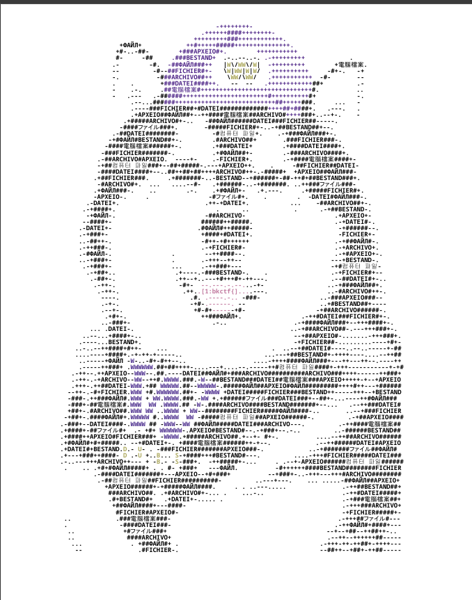
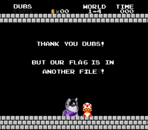
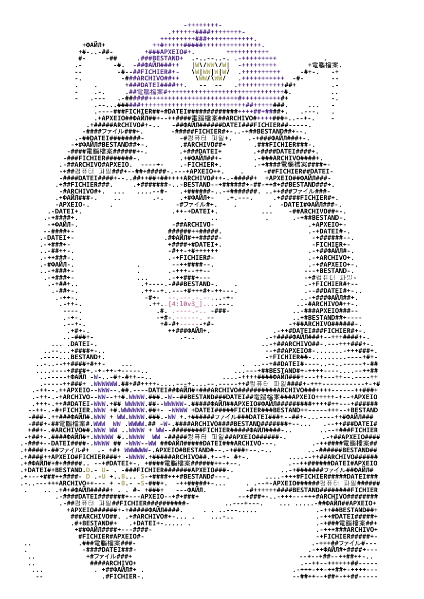
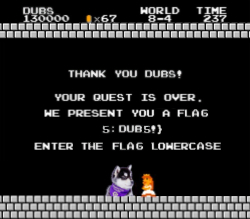
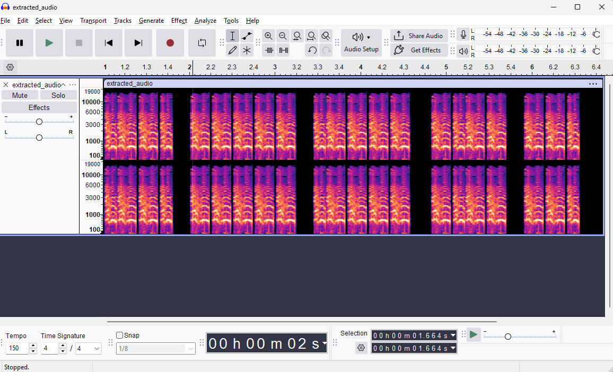

Super Dubs World is a 5-step challenge where we're given a [polyglot](https://en.wikipedia.org/wiki/Polyglot_(computing)) file that first takes the form of a pdf. During the competition, 26 out of 526 teams were able to solve this challenge. Shoutout to the challenge author JRitz and Batmans Kitchen for the competition.


## Challenge Description

Dubs recently started learning about ASCII art and decided to make a self-portrait! He says it's inspired by his favorite game franchise and his trips around the world.

The result is a single file that's... unique, to say the least. Dubs seems very proud of it!

Looks like he ate something strange, too. Maybe look into that?

## Flag: Part One

I'm given a single pdf file:
```bash
$ ls -lh
total 320K
-rwxrwxrwx 1 jayden jayden 320K Feb  5 20:56 dubs.pdf
```

Opening up the pdf file, I'm presented with the following ASCII art which gives me the first part of the flag:



	bkctf{}

## Flag: Part Three

Running `file` tells me that it's some sort of icon file, though... weird.

```bash
$ file dubs.pdf
dubs.pdf: MS Windows icon resource - 1 icon, 256x256 with PNG image data, 250 x 219, 8-bit/color RGBA, non-interlaced, 32 bits/pixel
```

Checking the hex dump of the file and doing some research tells me that it actually matches the header format for a `.ico`, confirming what the `file` command told us. This file takes form in multiple formats, meaning it's a polyglot file!

```bash
$ xxd dubs.pdf | head
00000000: 0000 0100 0100 0000 0000 0000 2000 796d  ............ .ym
00000010: 0000 f62d 0000 3c21 2d2d 0a25 5044 462d  ...-..<!--.%PDF-
00000020: 312e 340a 0a31 2030 206f 626a 0a3c 3c2f  1.4..1 0 obj.<</
00000030: 4c65 6e67 7468 2031 3831 3037 353e 3e0a  Length 181075>>.
00000040: 7374 7265 616d 0a00 0000 0000 0000 0000  stream..........
00000050: 0000 0000 0000 0000 0000 0000 0000 0000  ................
00000060: 0000 0000 0000 0000 0000 0000 0000 0000  ................
00000070: 0000 0000 0000 0000 0000 0000 0000 0000  ................
00000080: 0000 0000 0000 0000 0000 0000 0000 0000  ................
00000090: 0000 0000 0000 0000 0000 0000 0000 0000  ................
```

Renaming the file with the `.ico` extension gives me the third part of the flag:



	lots_

## Flag: Part Four

`binwalk` and `foremost` are tools I can use to recover more hidden/embedded files inside of this polyglot. Personally, I prefer foremost because I've been using it longer, though binwalk would also work for this challenge.

```bash
$ foremost -i dubs.pdf -o dubs_extracted
Processing: dubs.pdf
|foundat=dubs.pdfUT
*|

$ tree dubs_extracted/
dubs_extracted/
├── audit.txt
├── pdf
│   └── 00000000.pdf
├── png
│   └── 00000022.png
└── zip
    └── 00000444.zip

4 directories, 4 files
```

`audit.txt` is a default file foremost produces that gives a summary of the extracted files. Opening up the pdf and png gives me the flags I've already seen from before.

Attempting to unzip gives me the following error:
```bash
$ unzip dub_extracted/zip/00000444.zip
Archive:  zip/00000444.zip
error [zip/00000444.zip]:  missing 227476 bytes in zipfile
  (attempting to process anyway)
error: invalid zip file with overlapped components (possible zip bomb)
```

It seems like the polyglot structure of this challenge gave me a corrupted zip file. It turns out that zip actually has a feature where it refuses to deal with split archives.

From `man zip`:

```
Split archives.  zip version 3.0 and later can create split archives.
A split archive is a standard zip archive split over multiple files.
(Note that split archives are not just archives split in to pieces, as
the offsets of entries are now based on the start of each split.
Concatenating the pieces together will invalidate these offsets, but
unzip can usually deal with it.  zip will usually refuse to process
such a spliced archive unless the -FF fix option is used to fix the
offsets.)
```

I can use the `-FF` feature to get it into the correct format:

```bash
$ zip -FF extracted_files/zip/00000444.zip --out extracted_files/zip/repaired.zip

$ unzip extracted_files/zip/repaired.zip -d extracted_files/zip/unzipped
Archive:  extracted_files/zip/repaired.zip
  inflating: extracted_files/zip/unzipped/dubs.pdf
```

Viewing the new pdf file gives the fourth part of the flag:



	l0v3_

## Flag: Part Five

Using foremost again on the new pdf file gives me a new image which is part 5 of the flag.

```bash
$ foremost -i extracted_files/zip/unzipped/dubs.pdf -o second_extract

$ tree second_extract/
second_extract/
├── audit.txt
├── pdf
│   └── 00000000.pdf
└── png
    └── 00000002.png

3 directories, 3 files
```



	dub5!}

## Flag: Part Two

For me, this part was the hardest to find since foremost and binwalk failed to find the last hidden file.

Since this was the second flag, I assumed I would need to use some sort of utility on the original file.

Using ffmpeg on the original `dubs.pdf` gives me a hidden mp4 file:

```bash
$ ffmpeg -i dubs.pdf -c copy extracted_video.mp4
```

<div style="text-align: center;">
<video controls width="360">
  <source src="extracted_video.mp4" type="video/mp4">
</video>
</div>

The audio is morse code, so I extract the audio from the video to plug it into Audacity:

```bash
$ ffmpeg -i dubs.pdf -vn extracted_audio.mp3
```



This gives me the following morse code: `.--.  ----- .---- -.-- --.`

Which decodes to the second part of the flag:

	p01yg

## Full Flag

Combining all parts gives the full flag: `bkctf{p01yglots_l0v3_dub5!}`
